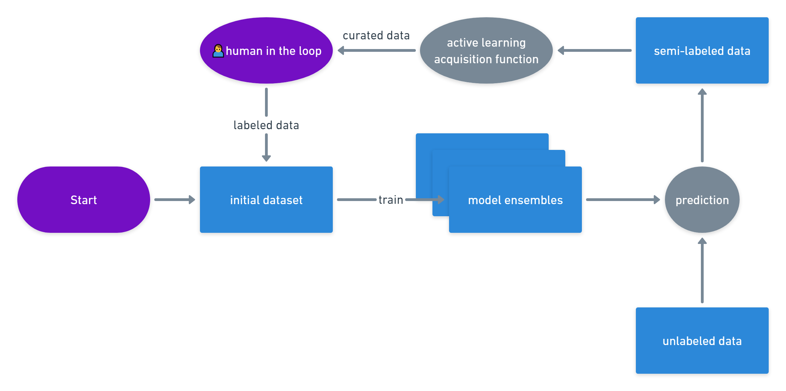

# Smartathon 2023

This is our submission for the Global AI summit Smartathon challenge for theme 1 at https://smartathon.hackerearth.com

This project aimed to tackle the issue of visual pollution in the streets of Saudi Arabia by developing a high-performing, AI model that detects 11 different classes of visual pollutants.

Utilizing a combination of deep learning training techniques, and auto-labeling, our team trained models and were able to achieve competitive results with a Mean Average Precision (mAP) evaluation of **61.24** in the unseen test set (**77.72** but with a catch).

## Team members

- theefaris@gmail.com
- serrymrss@gmail.com
- ibraheemkhurfan@gmail.com
- Shyom.1417@gmail.com
- rashamalqahtani@gmail.com


There are still some failure cases like very low quality images and it sometimes mistakes oil spills for potholes, this will be resolved in future work.

## Method

We used a combination of transfer learning and fine-tuning to train our model.
We did a lot of data preprocessing and model tuning and ensemble to get the best results and use black box testing to get the best results.

We used the following models:

YoloV5x and yolov5x6 (and tried YoloV7 but results weren't improved)


### Active learning - (mostly) self labeling pipeline

The pipeline is not fully developed yet and this repo still doesn't have the code for it.



There is much more experiment and trianing code that wasn't included, but everything needed to run the model is included in this repo.

## Inference

to try out a few images, use the gradio demo:

```sh
python demo.py
```

To run inference on a folder of images, use the following command (you may have to run this many times to reproduce the results):

Download submitted models from [submission.zip](https://drive.google.com/file/d/1HE34KxOMEBPt2EcMiQIo6Ywv_7YGuHNv/view?usp=share_link) and extract the models in repositories/yolov5/smartathon

```sh
git clone https://github.com/FarisHijazi/SDAIAsmartathon
cd SDAIAsmartathon

unzip submission.zip  # https://drive.google.com/file/d/1HE34KxOMEBPt2EcMiQIo6Ywv_7YGuHNv/view?usp=share_link

mkdir repositories/
git clone https://github.com/ultralytics/yolov5 repositories/yolov5
cd repositories/yolov5
pip install -r requirements.txt  # install dependencies from yolov5

# run prediction on 3 models
# note that --augment will produce different results each time, so you may have to run this many times to reproduce the results
python detect.py --weights \
    ../../submission/yolov5s/weights/best.pt \
    ../../submission/exp88/weights/best.pt \
    ../../submission/yolov5x6-heavyaug-mergetesttrain2/weights/best.pt \
    --augment --source ../../data/test/ --save-txt --save-conf

# convert predictions from txt files to csv files
# (change exp1234 to the experiment number you want to run)
cd ../..
python cocodir2submission.py repositories/yolov5/runs/detect/exp1234/labels/ --conf_thresh .42
```

<details>
<summary>Click here for more</summary>

## setup minio for DVC

```sh
docker run --name Minio -e MINIO_ROOT_USER=admin -e MINIO_ROOT_PASSWORD=supersecret -p 9000:9000 -p 9001:9001 -v /d/data/minio:/data -d quay.io/minio/minio:latest server /data --console-address ":9001"
```

## Repos

- https://github.com/sekilab/RoadDamageDetector
- https://colab.research.google.com/drive/1X9A8odmK4k6l26NDviiT6dd6TgR-piOa

## class distribution of submissions

| all this class | class name | score |
| --- | --- | --- |
| 0 | GRAFFITI | 6.86638 |
| 1 | FADED_SIGNAGE | 0.95170 |
| 2 | POTHOLES | 10.68917 |
| 3 | GARBAGE | 36.69862 |
| 4 | CONSTRUCTION_ROAD | 9.37099 |
| 5 | BROKEN_SIGNAGE | 0.48359 |
| 6 | BAD_STREETLIGHT | 0.03187 |
| 7 | BAD_BILLBOARD | 10.49133 |
| 8 | SAND_ON_ROAD | 4.95140 |
| 9 | CLUTTER_SIDEWALK | 10.45390 |
| 10 | UNKEPT_FACADE | 0.66649 |

summation: 91.65544000000001

</details>
